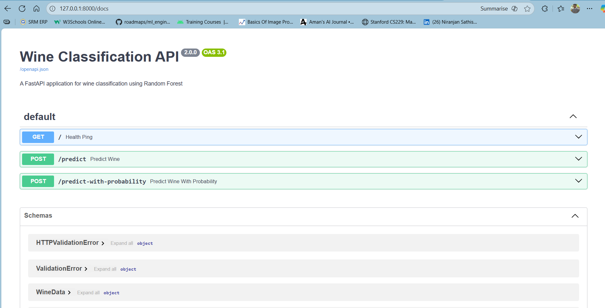
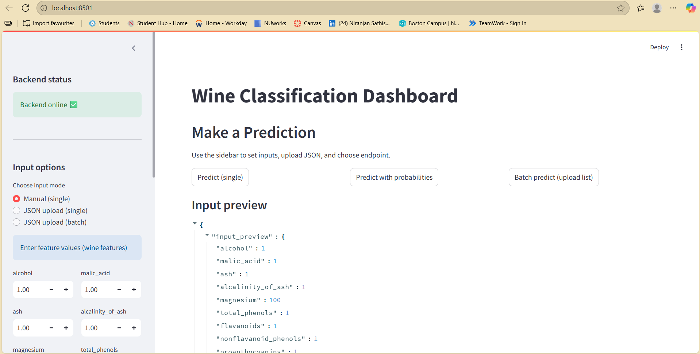
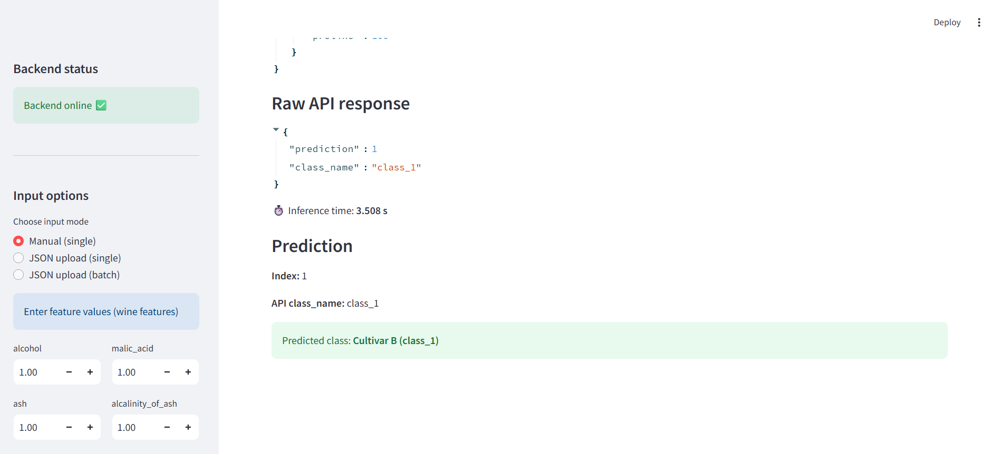
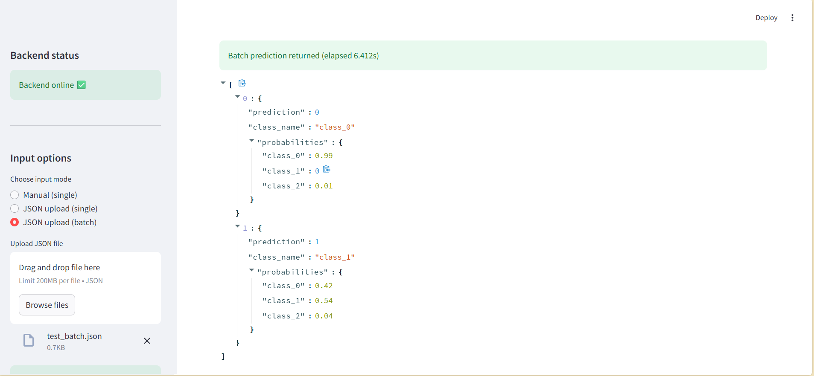
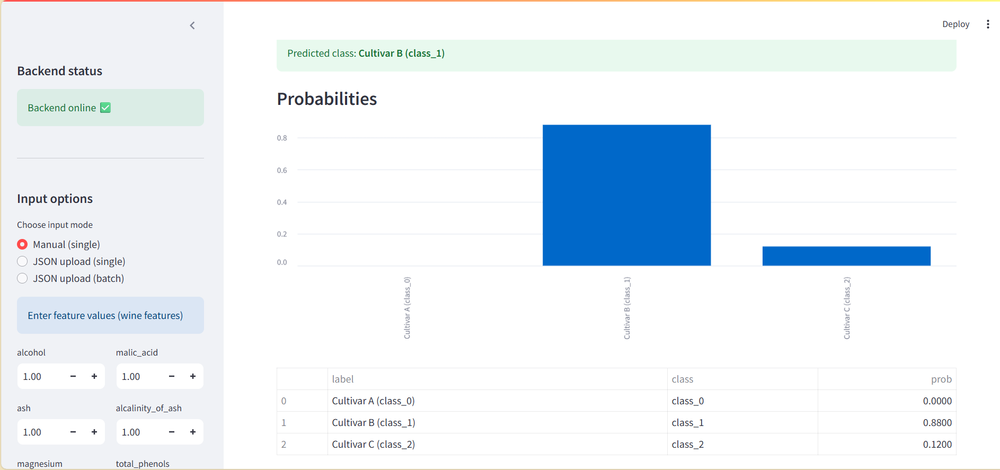

# MLOps Lab  5: FastAPI + Streamlit Dashboard (Wine Classifier)

## 👤 **Author:** Niranjan Sathish  

# 📝 **1. Introduction**
This Lab implements a machine learning deployment pipeline using:

- **FastAPI** as the backend inference server
- **Streamlit** as the frontend dashboard
- A **Wine Classification Model** trained using scikit-learn
- Support for **manual inputs**, **single JSON input**, and **batch JSON prediction**
- Probability visualization and user-friendly prediction labels

This README documents your setup process, how to run the system, how to test it, and where to add screenshots for your lab submission.

---

# 🧠 **2. Architecture Overview**

```
                       ┌────────────────────────────┐
                       │     Streamlit Dashboard     │
                       │    (User-facing Frontend)   │
                       └───────────────▲─────────────┘
                                       │ JSON Requests
                                       │
                       ┌───────────────┴─────────────┐
                       │          FastAPI API         │
                       │    /predict + /predict-proba │
                       └───────────────▲─────────────┘
                                       │
                       ┌───────────────┴─────────────┐
                       │        ML Model (.pkl)       │
                       │   Trained on Wine Dataset    │
                       └──────────────────────────────┘
```

---

# ⚙️ **3. Features Implemented**

### ✔ FastAPI Backend
- Loads trained Wine classifier model
- Two endpoints:
  - `/predict` — returns predicted class
  - `/predict-with-probability` — returns prediction + probabilities

### ✔ Streamlit Dashboard
- Manual input form for all 13 features
- JSON upload (single record or batch)
- Probability bar chart
- User-friendly class label mapping
- Backend health check
- Input preview
- Fallback batch prediction (even if API only accepts single records)

### ✔ Enhanced Add-ons
- Friendly class display: "Cultivar A / B / C"
- Prediction latency display
- Raw API response viewer

---

# 🗂️ **4. Project Structure**

```
project/
│── backend/
|   ├── requirements.txt
│   ├── model/
│       ├── wine_model.pkl
│   ├── src/
│       ├── main.py
│       ├── data.py
│       ├── predict.py
│       ├── train.py
│   
│── frontend/
│   ├── Dashboard.py
│   ├── requirements.txt
│   ├── data/
|       ├── test.json
│
└── README.md
```

---

# 🧭 **5. Installation & Setup**

## **Step 1 — Create Virtual Environment**
```bash
python -m venv venv
source venv/bin/activate            # macOS / Linux
.\venv\Scripts\activate             # Windows
```

## **Step 2 — Install Backend Dependencies**
```bash
cd backend
pip install -r requirements.txt
```
Or manually:
```bash
pip install fastapi uvicorn scikit-learn pandas numpy joblib
```

## **Step 3 — Run FastAPI Backend**
```bash
uvicorn main:app --reload --port 8000
```

Backend available at:
- API Root: http://localhost:8000
- Docs: http://localhost:8000/docs

>  

---

## **Step 4 — Install Frontend Dependencies**
```bash
cd ../frontend
pip install -r requirements.txt
```
Or manually:
```bash
pip install streamlit requests pandas
```

## **Step 5 — Run the Streamlit Dashboard**
```bash
streamlit run Dashboard.py
```

Dashboard will open at:
👉 http://localhost:8501

> 
 

---

# 🧪 **6. JSON Input Formats**

## ✔ **Single Input (Flat JSON)**
```json
{
  "alcohol": 13.2,
  "malic_acid": 2.8,
  "ash": 2.3,
  "alcalinity_of_ash": 18.5,
  "magnesium": 105,
  "total_phenols": 2.95,
  "flavanoids": 3.32,
  "nonflavanoid_phenols": 0.22,
  "proanthocyanins": 2.38,
  "color_intensity": 5.75,
  "hue": 1.25,
  "od280_od315_of_diluted_wines": 3.17,
  "proline": 1510
}
```

>  
---

## ✔ **Batch Input (List of Records)**
```json
[
  {
    "alcohol": 13.4,
    "malic_acid": 2.6,
    "ash": 2.3,
    "alcalinity_of_ash": 18,
    "magnesium": 102,
    "total_phenols": 2.9,
    "flavanoids": 3.3,
    "nonflavanoid_phenols": 0.25,
    "proanthocyanins": 2.4,
    "color_intensity": 6,
    "hue": 1.23,
    "od280_od315_of_diluted_wines": 3.1,
    "proline": 1450
  },
  {
    "alcohol": 12.5,
    "malic_acid": 1.9,
    "ash": 2.1,
    "alcalinity_of_ash": 16.8,
    "magnesium": 96,
    "total_phenols": 2.3,
    "flavanoids": 2.5,
    "nonflavanoid_phenols": 0.3,
    "proanthocyanins": 1.95,
    "color_intensity": 4.1,
    "hue": 1.05,
    "od280_od315_of_diluted_wines": 2.8,
    "proline": 950
  }
]
```

> 

---


# 🏁 **7. Conclusion**
This lab demonstrates a complete machine learning deployment pipeline using FastAPI and Streamlit. It includes:

- Model training and serialization
- API-based model serving
- Interactive dashboard visualization
- JSON-based prediction workflows
- Batch processing support
- Probability explanations

You have successfully implemented and extended the professor’s template with additional features and improved usability.

---

# 🖼️ **10. Screenshots**

### 📸 FastAPI Running:


### 📸 Streamlit:


### 📸 Manual Input Prediction:


### 📸 Probability Chart:


### 📸 Batch Prediction Output:


---


